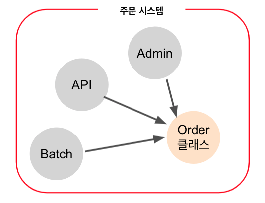
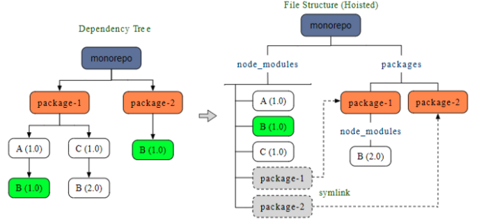

# Lerna로 Mono Repo (Typescript & Jest) 환경 구성하기 

보통 하나의 도메인 시스템을 운영할때 프로젝트 하나만으로는 해결이 안될 때가 많습니다.  
  
이를테면 다음과 같은 경우인데요.



> 어떤 분은 이걸 보고 MSA 라고 하시기도 하는데요.  
> API / Admin / Batch 가 분리된걸로 **절대로 MSA 라고 하진 않습니다**.


하나의 주문시스템을 위해 3개의 하위 프로젝트가 있는 상태입니다.  

* 주문 어드민
* 주문 API
* 주문 배치

이 3개는 배포되는 서버도 다르고 다른 코드 베이스를 가지고 있는데요.  
하지만 이들이 공통적으로 필요로 하는 Order Entity는 어떻게 관리해야할까요?  

* npm 저장소에 올려서 사용하기에는 **실시간성이 떨어집니다**
* 모든 하위 프로젝트들이 동일한 파일을 복사해서 관리하는건 유지보수가 굉장히 힘듭니다.  


보통 이를 Mono Repo (Multiple Packages OR [Multi Module](https://jojoldu.tistory.com/123))


* Mono Repo는 **우리 회사 프로젝트 전체를 하나의 저장소로 올리는 것을 의미하진 않습니다**.
  * 도메인별로 Mono Repo를 유지해야 함을 의미합니다.
* 사내 전체에서 사용되는 config / 유틸 JS 파일등은 당연히 **별도의 저장소**를 사용해야 합니다.

```bash
lerna init -i 
```

**root/lerna.json**

```json
{
  "packages": [
    "packages/*"
  ],
  "version": "independent",
  "npmClient": "yarn",
  "useWorkspaces": true
}
```

우리는 version 정책을 독립 모드로 가져가기 때문에 version: "independent"로 지정한 것이고,
yarn을 사용할 것이기 때문에 npmClient: "yarn" 그리고 yarn workspace 사용을 위해 useWorkspaces: true로 지정하였다.

* `lerna.json`
    * lerna 설정
* 최상위 package.json
    * `devDependencies` 중 공통 모듈
    * 프로젝트 전체를 대상으로 하는 `script`
* `packages`
    * 수동 / `lerna create 패키지명` 으로 자동생성 모두 가능

**root/package.json**

```json
{
  "name": "root",
  "private": true,
  "workspaces": [
    "packages/*"
  ],
  "devDependencies": {
    "lerna": "^4.0.0"
  }
}
```    

```bash
lerna create order-log
lerna create order-base
```

## Yarn workspaces



(https://classic.yarnpkg.com/)

배포와 버전관리는 러나 
* yarn workspaces도 일부 command를 제공하긴 하지만, 여러 개의 패키지를 용이하게 관리 할 수 있는 CLI 명령어는 Lerna에서 많이 제공 되고 있습니다(publish, version 등). 
* 위에서 설명한 commands 말고도 패키지들을 효율적으로 관리하고 배포 할 수 있는 상당히 많은 명령어를 제공하고 있는데(링크) 자동화를 위한 CI설정에서 마주칠 수 있는 다양한 상황에 대응 할 수 있는 많은 옵션들이 많아서 좋았고 관련한 이슈와 수정사항이 지속해서 개발되고 있다는 점도 Lerna를 매력적인 모노레포 매니저로 만드는 중요한 요소인 것 같습니다.

패키지 관리는 Yarn으로 
* yarn 은 npm과 함께 개발자에게 많이 사용되는 패키지 매니저 
* npm이 모노레포를 지원하지 않는 반면에 yarn은 yarn workspaces 를 추가적인 라이브러리 설치 없이 쉬운 방법으로 제공하고 있고 속도와 안정성을 위주로 계속 개발 할것을 암시하며 개발자들의 만족감을 올려주고 있습니다. 
  Yarn workspaces가 불필요하게 lerna bootstrap 등의 명령을 실행하지 않으면서 더 안전하고(버그없이) 깔끔하게 패키지를 관리해주므로 Lerna + yarn workspaces의 조합이 많은 개발자들에게 선택을 받는 것 같습니다.

## 의존성 설치

### 공통 의존성 설치

공통으로 사용될 모듈로 eslint를 설치해보자

```bash
yarn add eslint --dev --ignore-workspace-root-check
```

```bash
yarn add @types/jest jest @types/jest typescript --dev --ignore-workspace-root-check
```

### 개별 의존성 설치

```bash
lerna add express --scope=order-log
```

혹은 직접 모듈로 가서 설치

```bash
cd order-base
lerna add express --scope=order-log
```

### 패키지별 의존성

```bash
lerna add order-base --scope=order-log
```
