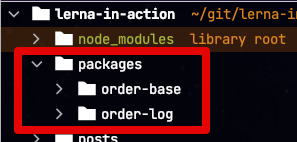
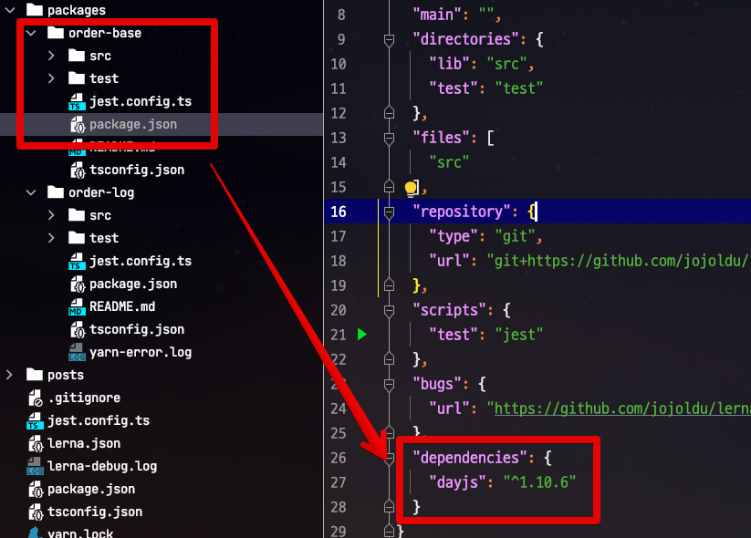
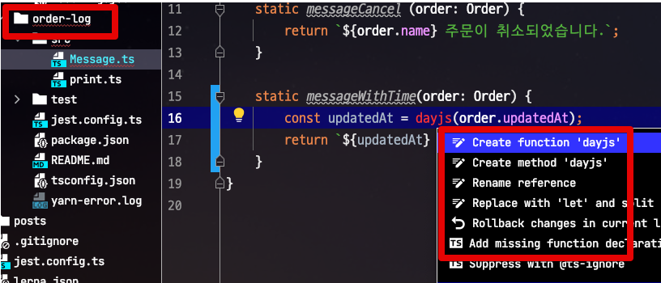
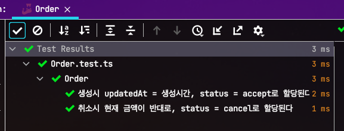
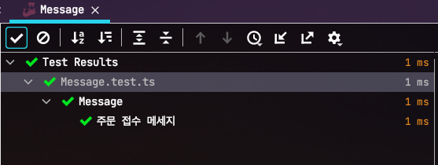
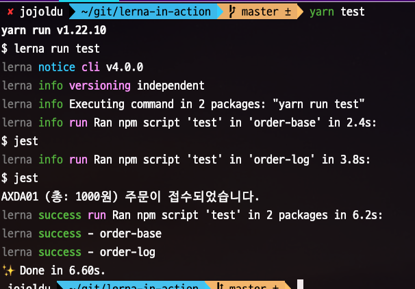

# Lerna와 yarn-workspace를 활용한 Mono Repo (Typescript & Jest) 환경 구성하기 

보통 하나의 도메인 시스템을 운영할때 프로젝트 하나만으로는 해결이 안될 때가 많습니다.  
  
이를테면 다음과 같은 경우인데요.


> 어떤 분은 이걸 보고 MSA 라고 하시기도 하는데요.  
> API / Admin / Batch 가 분리된걸로 **절대로 MSA 라고 하진 않습니다**.


하나의 주문시스템을 위해 3개의 하위 프로젝트가 있는 상태입니다.  

* 주문 어드민
* 주문 API
* 주문 배치

이 3개는 **주문시스템**을 이루는 프로젝트들입니다.  
배포되는 서버도 다르고 다른 코드 베이스를 가지고 있는데요.  
하지만 이들이 공통적으로 필요로 하는 **Order Entity는 어떻게 관리해야할까요**?  

* npm 저장소에 올려서 사용하기에는 **실시간성이 떨어집니다**
* 모든 하위 프로젝트들이 **동일한 파일을 복사**해서 관리하는건 **유지보수가 굉장히 힘듭니다**.  

그래서 이런 문제를 해결하기 위해 여러 생태계에서 방법들을 고민하는데요.  
대표적인 사례로 Mono Repo (Multiple Packages 혹은 [Multi Module](https://jojoldu.tistory.com/123)) 가 있습니다.

* Mono Repo는 **우리 회사 프로젝트 전체를 하나의 저장소로 올리는 것을 의미하진 않습니다**.
  * 도메인별로 Mono Repo를 유지해야 함을 의미합니다.
* 사내 전체에서 사용되는 config / 유틸 JS 파일등은 당연히 **별도의 저장소**를 사용해야 합니다.

NodeJS에서 Mono Repo를 관리하는 가장 대표적인 방법으로 Lerna & Yarn Workspace 조합이 있습니다.


* `lerna`는 각 패키지들을 배포하고 버전 관리하는 역할을 합니다.
* `yarn`은 각 패키지간의 의존성 관리 하는 역할을 합니다.

lerna로도 패키지간 의존성을 관리할 수 있지만, **lerna로 패키지 의존성을 관리할때 이슈**가 있기 때문에 각 도구가 서로 잘하는 역할만 하도록 설정을 합니다.

> 패키지 의존성 관리는 lerna보다 yarn이 좋은 상세한 이유는 [lerna? yarn workspace? 크게 개념만 잡아보기](https://simsimjae.medium.com/monorepo-lerna-yarn-workspace-%ED%81%AC%EA%B2%8C-%EA%B0%9C%EB%85%90%EB%A7%8C-%EC%9E%A1%EC%95%84%EB%B3%B4%EA%B8%B0-c58bc4ba31fe) 을 보시면 좋습니다.

자 그럼 한번 이제 간단한 프로젝트를 구성하면서 `lerna`과 `yarn workspace` 조합을 배워보겠습니다.

## 1. 설치

CLI를 사용하기 위해 전역으로 `lerna`를 설치하겠습니다.

```bash
npm install -g lerna
```

그리고 신규 디렉토리를 하나 만드신 뒤, 아래 명령어로 디렉토리를 `lerna`로 구성합니다.

```bash
lerna init -i
```

그럼 아래와 같이 디렉토리가 구성되는데요.

* `lerna.json`
    * 프로젝트 lerna 설정
* 최상위 `package.json`
    * 하위 프로젝트들이 공통으로 사용할 `dependencies` 선언
    * 프로젝트 전체를 대상으로 하는 `script`
* `packages`
    * 하위 프로젝트들이 담길 상위 디렉토리
    * 수동 / `lerna create 패키지명` 으로 자동 생성 모두 가능

각각에 대해서 소개드리겠습니다.

### 1-1. 설치 요소

**root/lerna.json**  
  
기본 생성된 `lerna.json`을 아래와 같이 수정합니다.

```json
{
  "packages": [
    "packages/*"
  ],
  "version": "independent",
  "npmClient": "yarn",
  "useWorkspaces": true
}
```

* `version: "independent"`
  * 패키지 배포와 관련된 버전을 패키지별로 독립적으로 가져가기 위한 설정 
* `npmClient: "yarn"`
  * `npm` 대신에 `yarn`을 사용하기 위해 선언
* `useWorkspaces: true`
  * 맨 위에서 언급한것처럼 `yarn workspace` 를 사용하기 위해서 `true`로 선언합니다.

**root/package.json**

```json
{
  "name": "root",
  "private": true,
  "workspaces": [
    "packages/*"
  ],
  "devDependencies": {
    "lerna": "^4.0.0"
  }
}
```    

* `private: true`
  * **루트 프로젝트**가 NPM Repository로 배포되는 것을 금지합니다.
  * NPM 패키지를 배포하기 위한 용도가 아니라면 불필요한 옵션입니다.
* `workspaces: []`
  * workspace에 담길 패키지를 지정합니다.
  * `lerna.json`의 `packages`의 경로와 일치

### 1-2. yarn workspace

yarn workspace를 간단하게 소개하면 다음과 같습니다.


(출처: https://classic.yarnpkg.com/)

현재 프로젝트는 다음과 같이 조합합니다.

* `lerna`는 각 패키지들을 배포하고 버전 관리하는 역할을 합니다.
* `yarn`은 각 패키지간의 의존성 관리 하는 역할을 합니다.

여기서 `yarn workspaces` 만으로 구성하지 않는 이유는, 여러 개의 패키지를 용이하게 관리 할 수 있는 CLI 명령어 (`publish`, `version` 등)는 Lerna에서 많이 제공 되고 있기 때문입니다.

> 물론 `yarn workspaces` 도 일부 command를 제공하긴 합니다.

이런 CLI 명령어들이 결국은 CI를 통해 진행되는 배포 자동화에서 발생할 수 있는 여러 이슈들에 대해서 좀 더 편하게 대응할 수 있기 때문입니다.  
  
반면에 패키지 관리는 `yarn`으로 하는 이유는 다음과 같습니다.

* `npm`은 모노레포를 지원하지 않음 
  * `yarn` 은 `yarn workspaces` 를 추가적인 라이브러리 설치 없이 쉬운 방법으로 제공
* `yarn workspaces` 가 불필요하게 `lerna bootstrap` 등의 명령을 실행하지 않으면서 더 안전하고 깔끔하게 패키지를 관리

자 그럼 실제로 간단하게 2개의 하위 패키지를 추가해보겠습니다.

## 2. 패키지 생성 및 의존성 추가

아래 명령어로 2개의 하위 패키지를 구성합니다.

```bash
lerna create order-log
lerna create order-base
```

그럼 `packages` 하위에 `order-base`와 `order-log` 2개의 프로젝트가 추가됩니다.  



그럼 이제 의존성 추가하는 방법을 하나씩 해보겠습니다.

### 2-1. 공통 의존성 설치

공통 의존성이라 하면 **root** 에 등록될 패키지들을 의미합니다.  
  
테스트로 한번 적용해보겠습니다.  
프로젝트 전체에 TS 스택이 사용될 예정이니 TS 스택을 아래와 같이 실행합니다.  
실행 위치는 **root** 입니다.

**root**

```bash
yarn add @types/jest jest @types/node ts-jest ts-node typescript --dev --ignore-workspace-root-check
```

* `yarn workspace` 를 사용하게 되면 기본적으로 패키지안에 모듈을 설치하는 것으로 간주하므로 `workspace-root-check` 를 무시하고 설치해줍니다.

이렇게할 경우 **root/package.json**에는 아래와 같이 의존성이 추가됩니다.

```json
{
  "name": "root",
  "private": true,
  "workspaces": [
    "packages/*"
  ],
  "devDependencies": {
    "@types/jest": "^26.0.24",
    "@types/node": "^16.0.1",
    "jest": "^27.0.6",
    "lerna": "^4.0.0",
    "ts-jest": "^27.0.3",
    "ts-node": "^10.0.0",
    "typescript": "^4.3.5"
  }
}
```

### 2-2. 개별 의존성 설치

만약 개별 모듈에서 각각 외부 패키지 등록이 필요하다면 다음과 같이 등록할 수 있습니다.

```bash
yarn workspace 모듈명 add 패키지명 [--dev]
```

이를테면 `order-log` 모듈에 `chalk` 패키지를 `dev`로 등록한다면 다음과 같습니다.

```bash
yarn workspace order-log add chalk --dev 
```

```bash
yarn workspace order-log add chalk --dev 
```

### 2-3. 로컬 패키지 등록

(제가 못찾아서 그렇겠지만) 내부 (로컬) 패키지를 의존성을 등록하는 방법은 바로 `package.json` 에 추가하면 됩니다.

**order-log/package.json**

```json
"dependencies": {
  "order-base": "1.0.0",
}
```

### 2-4. 패키지 의존성 상속

Gradle Mutli Module을 사용하시는 분들이라면 의존성 상속에 대해서 당연하게 생각하실텐데요.  
(제가 검색해본 내에서는) Lerna / yarn workspace 에서는 의존성 상속이 안됩니다.  
  
즉, Entity 모듈 (상위) 이 TypeORM을 갖고 있다고 해서 이를 의존 있는 하위 모듈 (web / api / admin 등) 들이 **자동으로 TypeORM을 가지고 있을 순 없다**는 것입니다.

예를 들어, `order-base`에 `dayjs`를 의존성을 추가했다고 해서



하위 모듈인 `order-log`가 `dayjs`를 사용할 수는 없다는 것이죠.



개인적으로는 모노레포가 활성화된 Gradle 환경에서 하다보면 **좀 더 세밀하게 의존성 관리를 해야하는데 그러지 못하다는 점**이 굉장히 아쉽습니다.  
(All or One 느낌이랄까요?)

> 이거 아시는 분 계시면 공유 부탁드립니다!

## 3. 테스트

이렇게 만들어진 `order-base`와 `order-log` 프로젝트들을 테스트해보겠습니다.

### 3-1. order-base 테스트

order-base 프로젝트는 Order Entity 객체를 하나 만들어둡니다.  
  
**order-base/src/Order.ts**

```javascript
export class Order {
    name: string;
    amount: number;
    payType: string;
    status: string;
    updatedAt: Date;

    constructor() {
    }

    static accept (name, amount, payType) {
        return Order.acceptWithNow(name, amount, payType, new Date());
    }

    static acceptWithNow (name, amount, payType, now) {
        const order = new Order();
        order.name = name;
        order.amount = amount;
        order.payType = payType;
        order.status = 'accept';
        order.updatedAt = now;

        return order;
    }

    createCancel() {
        return this.createCancelWithNow(new Date());
    }

    createCancelWithNow(now) {
        const cancelOrder = new Order();
        cancelOrder.name = this.name;
        cancelOrder.amount = this.amount * -1
        cancelOrder.payType = this.payType;
        cancelOrder.status = 'cancel';
        cancelOrder.updatedAt = now;

        return cancelOrder;
    }
}
```

그리고 이를 테스트할 테스트 코드를 작성해봅니다.  
  
**order-base/test/Order.test.ts**

```javascript
import {Order} from "../src/Order";

describe('Order', () => {
    it('생성시 updatedAt = 생성시간, status = accept로 할당된다', () => {
        const now = new Date ('2021-07-08');

        const order = Order.acceptWithNow('name', 1000, 'kakaopay', now);

        expect(order.updatedAt).toBe(now);
        expect(order.status).toBe('accept');
    });

    it('취소시 현재 금액이 반대로, status = cancel로 할당된다', () => {
        const now = new Date ('2021-07-08');
        const amount = 1000;
        const order = Order.acceptWithNow('name', amount, 'kakaopay', now);

        const cancel = order.createCancel();

        expect(cancel.amount).toBe(amount * -1);
        expect(cancel.status).toBe('cancel');
    });
});
```

테스트를 실행하기 위해 `jest` 명령어를 등록합니다.  
  
**order-base/package.json**

```json
"scripts": {
  "test": "jest"
},
```

그리고 위 테스트를 실행해보면?



테스트가 성공함을 볼 수 있습니다.

### 3-2. order-log 테스트

자 그럼 다음으로는 하위 모듈인 `order-log`를 테스트 해보겠습니다.  
  
먼저 마찬가지로 `package.json`에 `jest`를 추가합니다.  
  
**order-log/package.json**

```json
"scripts": {
  "test": "jest"
},
```

테스트할 코드와 테스트 코드를 추가합니다.  
  
**order-log/src/Message.ts**

```javascript
import {Order} from "order-base/src/Order";

export class Message {

    static messageAccept (order: Order) {
        return `${order.name} (총: ${order.amount}원) 주문이 접수되었습니다.`;
    }

    static messageCancel (order: Order) {
        return `${order.name} 주문이 취소되었습니다.`;
    }
}
```

**order-log/test/Message.test.ts**

```javascript
import {Order} from "order-base/src/Order";
import {Message} from "../src/Message";

describe('Message', () => {
    it('주문 접수 메세지', () => {
        const order = Order.accept('AXDA01', 1000, 'kakaopay');

        const message = Message.messageAccept(order);

        expect(message).toBe('AXDA01 (총: 1000원) 주문이 접수되었습니다.');
    });
});
```

그리고 이 테스트를 수행해보면?



**상위 모듈을 의존하고 있는 하위 모듈도 정상 작동**하는 것을 확인할 수 있습니다.

### 3-3. 전체 테스트

마지막으로 이렇게 작성된 테스트들을 전체 수행해보겠습니다.  
  
이때는 `lerna`의 스크립트를 사용하면 편한데요.  
우리는 `lerna test`를 사용해서 **전체 테스트 수행**을 하겠습니다.  
  
**root/package.json**

```json
"scripts": {
  "test": "lerna run test"
},
```

그리고 이제 `yarn test`로 전체 테스트를 수행해보면?



모든 테스트가 차례로 수행되어 성공함을 확인할 수 있습니다.

## 4. 마무리

이번 시간에는 간단하게 lerna + yarn workspace로 모노레포를 구성하는 방법을 배워보았는데요.  
다음 시간에는 본격 실전에 맞게 `express` 와 `typeORM` 등의 환경에서 모노레포 구성하는 방법을 배워보겠습니다.

## 참고

* [공식문서](https://classic.yarnpkg.com/en/docs/workspaces)